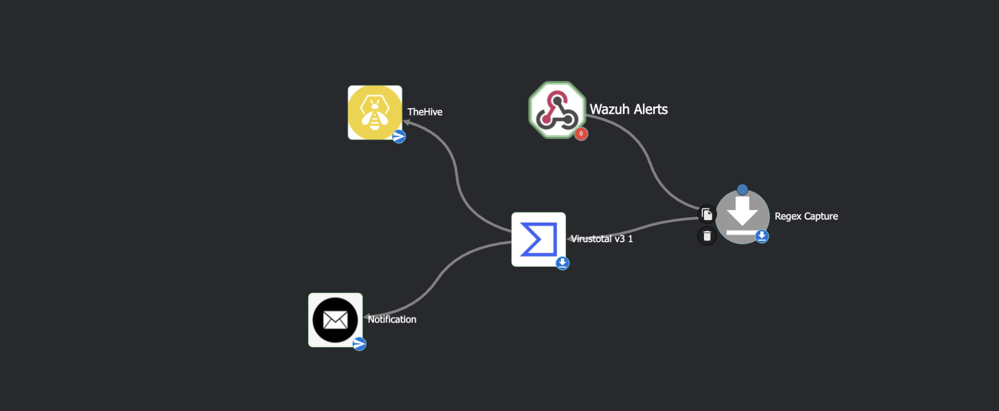
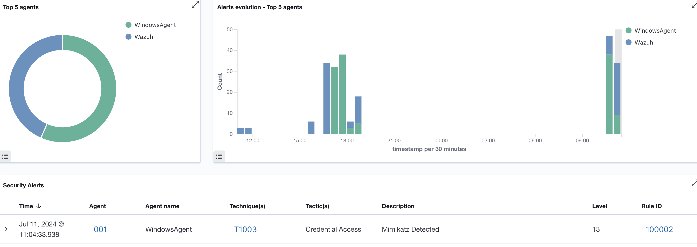
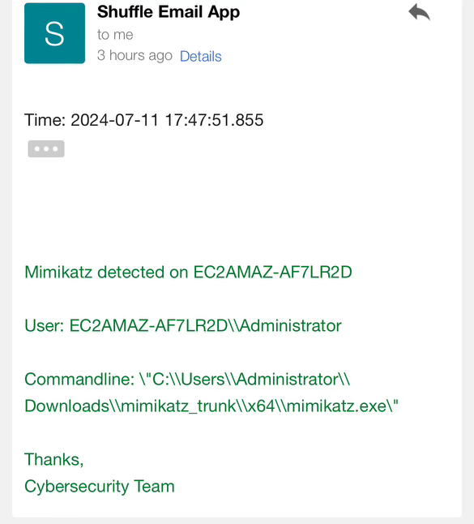

# Handson SOC Automation Project

This project automates the workflow for handling Mimikatz alerts within a Security Operations Center (SOC) using *windows 10 client ,Wazuh,thehive,shuffle on AWS EC2* . The automation is designed to streamline the process, from receiving an alert to initiating an investigation by a SOC analyst.

## Workflow Overview
1. Mimikatz Alert Sent to Shuffle
2. Shuffle Receives Mimikatz Alert
3. Extract SHA256 Hash From File
4. Check Reputation Score with VirusTotal
5. Send Details to TheHive to Create Alert
6. Send Email to SOC Analyst to Begin Investigation

## Detailed Workflow
    1. Mimikatz Alert Sent to Shuffle
        - Mimikatz alerts are sent to Shuffle, a security orchestration, automation, and response (SOAR) platform.

2. Shuffle Receives Mimikatz Alert
Upon receiving the alert, Shuffle performs the following actions:

Extracts the SHA256 hash from the file associated with the Mimikatz alert.
3. Check Reputation Score with VirusTotal
Shuffle checks the reputation score of the extracted SHA256 hash with VirusTotal to determine the file's maliciousness.

4. Send Details to TheHive to Create Alert
Based on the VirusTotal score, Shuffle sends detailed information about the alert to TheHive, an open-source incident response platform, to create an alert for further investigation.

5. Send Email to SOC Analyst to Begin Investigation
An email is sent to a designated SOC analyst with details of the alert, prompting them to begin an investigation.

Integration with Sysmon on Affected Windows System
Affected Windows System on EC2
The affected Windows system is an EC2 instance with Sysmon installed. This system is connected as a Windows agent to the Wazuh manager for enhanced monitoring and alerting capabilities.

Sysmon Configuration
Sysmon (System Monitor) is a Windows system service and device driver that logs system activity to the Windows event log. It provides detailed information about process creations, network connections, and file modifications.

Wazuh Integration
Wazuh, an open-source security monitoring platform, integrates with Sysmon to collect and analyze security event data. The Windows agent running on the EC2 instance sends Sysmon logs to the Wazuh manager for centralized monitoring and analysis.

Prerequisites
Shuffle: Installed and configured.
VirusTotal API Key: To check the reputation score.
TheHive: Installed and configured.
Email Server: Configured to send notifications to SOC analysts.
Sysmon: Installed and configured on the affected Windows system.
Wazuh: Installed and configured with the Windows agent reporting Sysmon logs.
Setup Instructions
Configure Shuffle:

Install Shuffle and set up the necessary integrations.
Ensure that Shuffle can receive Mimikatz alerts and extract SHA256 hashes.
Set Up VirusTotal Integration:

Obtain a VirusTotal API key.
Configure Shuffle to use this API key for checking file reputation scores.
Configure TheHive Integration:

Install and configure TheHive.
Set up Shuffle to send alert details to TheHive to create new alerts.
Email Notification Setup:

Ensure an email server is configured in Shuffle.
Set up email templates and rules to notify SOC analysts when an alert is received.
Configure Sysmon on Windows System:

Install Sysmon on the Windows EC2 instance.
Configure Sysmon with appropriate event monitoring rules.
Configure Wazuh Agent on Windows System:

Install the Wazuh agent on the Windows EC2 instance.
Ensure the Wazuh agent is properly sending Sysmon logs to the Wazuh manager.
Usage
Receive Mimikatz Alert: The workflow is triggered when a Mimikatz alert is sent to Shuffle.
Automated Processing:
Shuffle extracts the SHA256 hash and checks its reputation with VirusTotal.
Depending on the reputation score, Shuffle sends detailed information to TheHive and triggers an alert.
Notification: An email is sent to the SOC analyst with the alert details to begin the investigation.
Contributing
If you would like to contribute to this project, please fork the repository and submit a pull request. We welcome all contributions that improve the functionality and usability of this automation project.

License
This project is licensed under the MIT License. See the LICENSE file for details.

